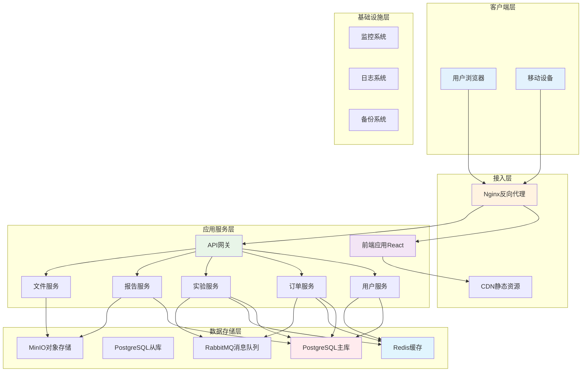

# LIS系统全栈技术架构文档

## 1. 文档概述

本文档基于当前已实现的前端交付，对技术架构与模块边界进行说明：系统前端采用 React 18 + TypeScript + Vite + Ant Design + Zustand + React Router，统一侧导航与路由分组，开发端口为 5173，后端与数据层将在后续阶段对接。

### 1.1 项目简介

本项目为实验室信息管理系统（LIS）的前端实现，面向订单、样本、实验流程、质量控制与报告全链路，强调可追溯性、可视化与一致性交互。
当前阶段已完成：实验管理（普检/特检/质谱）、库存管理、审批管理、后台配置（套餐/产品/检测项/客户/报告/技术路线/实验/审批）、系统管理（全局参数）；统一采用 React 18 + TypeScript + Vite + Ant Design + Zustand + React Router，路由分组与侧导航一致，开发端口 5173。
后续将按计划对接后端服务与数据层，完善权限、审计与数据安全。

### 1.2 设计目标

* **高可用性**: 7×24小时不间断服务，系统可用性达到99.9%

* **高性能**: 支持1000+并发用户，页面响应时间<2秒

* **高扩展性**: 微服务架构，支持水平扩展和垂直扩展

* **数据安全**: 多层次安全防护，符合医疗数据安全规范

* **易维护**: 模块化设计，清晰的代码结构和文档

## 2. 技术栈选型

### 2.1 前端技术栈

* **框架**: React\@18 + TypeScript\@5

* **构建工具**: Vite\@5

* **状态管理**: Zustand\@4

* **数据请求**: React Query\@5

* **路由管理**: React Router\@6

* **UI组件库**: Ant Design\@5

* **样式方案**: TailwindCSS\@3 + CSS Modules

* **表单处理**: React Hook Form + Zod

* **测试框架**: Vitest\@1 + React Testing Library\@14

* **模拟数据**: MSW (Mock Service Worker)

### 2.2 后端技术栈

* **运行时**: Node.js\@20 LTS

* **Web框架**: Express\@4

* **数据库**: PostgreSQL\@15 (主数据库)

* **缓存**: Redis\@7

* **消息队列**: RabbitMQ\@3

* **文件存储**: MinIO (对象存储)

* **API文档**: Swagger/OpenAPI\@3

* **任务调度**: node-cron + Bull

* **日志管理**: Winston + Logrotate

* **进程管理**: PM2

### 2.3 运维技术栈

* **容器化**: Docker + Docker Compose

* **反向代理**: Nginx

* **监控告警**: Prometheus + Grafana

* **链路追踪**: Jaeger

* **代码质量**: SonarQube

* **CI/CD**: GitLab CI/CD

## 3. 整体架构设计

### 3.1 系统架构图



### 3.2 微服务划分

| 服务名称 | 主要职责           | 数据库表                                                      | 技术栈                |
| ---- | -------------- | --------------------------------------------------------- | ------------------ |
| 用户服务 | 用户管理、权限管理、认证授权 | users, roles, permissions, user\_roles, role\_permissions | Node.js + Express  |
| 订单服务 | 订单管理、患者管理、客户管理 | orders, patients, customers, order\_items                 | Node.js + Express  |
| 实验服务 | 实验流程、样本管理、质控管理 | samples, experiments, experiment\_results, sample\_types  | Node.js + Express  |
| 报告服务 | 报告生成、报告审核、报告发布 | reports, report\_items, report\_templates                 | Node.js + Express  |
| 配置服务 | 系统配置、业务配置、模板管理 | configs, templates, approval\_processes                   | Node.js + Express  |
| 文件服务 | 文件上传、文件存储、文件管理 | files, file\_metadata                                     | Node.js + MinIO    |
| 通知服务 | 消息通知、邮件发送、短信发送 | notifications, messages                                   | Node.js + RabbitMQ |

## 4. 项目结构设计

### 4.1 前端项目结构

```
lis-frontend/
├── public/                          # 静态资源
├── src/
│   ├── @types/                      # TypeScript类型定义
│   ├── api/                        # API服务层
│   ├── components/                 # 可复用组件
│   ├── hooks/                      # 自定义Hooks
│   ├── pages/                      # 页面组件
│   ├── router/                     # 路由配置
│   ├── stores/                     # 状态管理
│   ├── styles/                     # 样式文件
│   ├── utils/                      # 工具函数
│   ├── App.tsx                     # 应用根组件
│   └── main.tsx                    # 应用入口
├── .env.development                 # 开发环境配置
├── .env.production                  # 生产环境配置
├── vite.config.ts                   # Vite配置
├── tsconfig.json                    # TypeScript配置
├── tailwind.config.js               # TailwindCSS配置
├── eslint.config.js                 # ESLint配置
├── prettier.config.js               # Prettier配置
└── package.json                     # 项目依赖
```

### 4.2 后端项目结构

```
lis-backend/
├── src/
│   ├── services/                     # 微服务目录
│   │   ├── user-service/           # 用户服务
│   │   ├── order-service/          # 订单服务
│   │   ├── test-service/           # 实验服务
│   │   ├── report-service/         # 报告服务
│   │   ├── config-service/         # 配置服务
│   │   ├── file-service/           # 文件服务
│   │   └── notification-service/     # 通知服务
│   ├── shared/                     # 共享模块
│   │   ├── database/               # 数据库连接
│   │   ├── cache/                  # 缓存模块
│   │   ├── queue/                  # 消息队列
│   │   ├── utils/                  # 工具函数
│   │   ├── middleware/             # 中间件
│   │   └── types/                  # 类型定义
│   ├── gateway/                    # API网关
│   └── config/                     # 配置文件
├── docker/                          # Docker配置
├── scripts/                         # 脚本文件
├── tests/                           # 测试文件
├── docs/                            # 文档
├── .env.development                 # 开发环境配置
├── .env.production                  # 生产环境配置
├── docker-compose.yml               # Docker编排
├── package.json                     # 项目依赖
└── tsconfig.json                    # TypeScript配置
```

## 5. 完整页面路由定义

### 5.1 路由结构

```typescript
// 路由按业务模块组织，支持嵌套路由和权限控制
const routes = [
  {
    path: '/',
    component: 'Layout',
    children: [
      { path: '', component: 'Home', meta: { title: '首页', permission: 'home.view' } },
      {
        path: 'order',
        component: 'OrderLayout',
        meta: { title: '订单管理', permission: 'order.view' },
        children: [
          { path: 'query', component: 'OrderQuery', meta: { title: '订单查询' } },
          { path: 'sample', component: 'SampleQuery', meta: { title: '样本查询' } },
          { path: 'delivery', component: 'DeliveryDownload', meta: { title: '交付下载' } }
        ]
      },
      {
        path: 'test',
        component: 'TestLayout',
        meta: { title: '实验管理' },
        children: [
          {
            path: 'routine',
            component: 'RoutineLayout',
            meta: { title: '普检实验' },
            children: [
              { path: '', component: 'RoutineTest', meta: { title: '普检实验', permission: 'test.routine' } },
              { path: 'exception', component: 'RoutineException', meta: { title: '异常处理', permission: 'test.routine.exception' } }
            ]
          },
          {
            path: 'special',
            component: 'SpecialLayout',
            meta: { title: '特检实验' },
            children: [
              { path: 'tech-route', component: 'TechRouteConfirm', meta: { title: '技术路线确认' } },
              { path: 'pretreatment', component: 'Pretreatment', meta: { title: '预处理' } },
              { path: 'preprocess', component: 'PreProcess', meta: { title: '上机前处理' } },
              { path: 'sequencing', component: 'Sequencing', meta: { title: '测序上机' } },
              { path: 'bio-analysis', component: 'BioAnalysis', meta: { title: '生信分析' } },
              { path: 'qpcr', component: 'QPCRAnalysis', meta: { title: 'QPCR分析' } },
              { path: 'data-review', component: 'SpecialDataReview', meta: { title: '数据审核' } },
              { path: 'exception', component: 'SpecialException', meta: { title: '异常处理' } }
            ]
          }
        ]
      }
    ]
  },
  { path: '/login', component: 'Login', meta: { title: '登录', noAuth: true } },
  { path: '/403', component: 'Forbidden', meta: { title: '无权限' } },
  { path: '/404', component: 'NotFound', meta: { title: '页面不存在' } }
];
```

### 5.2 权限控制

```typescript
// 基于角色的权限控制（RBAC）
interface RouteMeta {
  title: string;
  permission?: string;      // 权限标识
  roles?: string[];         // 角色要求
  noAuth?: boolean;        // 无需认证
  keepAlive?: boolean;     // 页面缓存
  hidden?: boolean;        // 隐藏菜单
}

// 权限验证逻辑
function checkPermission(userPermissions: string[], routePermission?: string): boolean {
  if (!routePermission) return true;
  return userPermissions.includes(routePermission);
}
```

## 6. 模块/服务细节设计

### 6.1 前端架构细节

#### 6.1.1 状态管理设计

```typescript
// Zustand状态管理，按模块划分
interface AppState {
  // 应用状态
  loading: boolean;
  sidebarCollapsed: boolean;
  theme: 'light' | 'dark';
  
  // 方法
  setLoading: (loading: boolean) => void;
  toggleSidebar: () => void;
  setTheme: (theme: 'light' | 'dark') => void;
}

interface AuthState {
  // 认证状态
  token: string | null;
  user: User | null;
  permissions: string[];
  
  // 方法
  login: (credentials: LoginCredentials) => Promise<void>;
  logout: () => void;
  refreshToken: () => Promise<void>;
  updateUser: (user: Partial<User>) => void;
}

interface OrderState {
  // 订单状态
  orders: Order[];
  currentOrder: Order | null;
  filters: OrderFilters;
  pagination: PaginationConfig;
  
  // 方法
  fetchOrders: (params?: OrderQueryParams) => Promise<void>;
  createOrder: (order: CreateOrderRequest) => Promise<void>;
  updateOrder: (id: string, order: UpdateOrderRequest) => Promise<void>;
  deleteOrder: (id: string) => Promise<void>;
}
```

#### 6.1.2 API服务层设计

```typescript
// 统一的API客户端
class APIClient {
  private client: AxiosInstance;
  
  constructor() {
    this.client = axios.create({
      baseURL: import.meta.env.VITE_API_BASE_URL,
      timeout: 30000,
      headers: {
        'Content-Type': 'application/json'
      }
    });
    
    // 请求拦截器
    this.client.interceptors.request.use(
      (config) => {
        const token = useAuthStore.getState().token;
        if (token) {
          config.headers.Authorization = `Bearer ${token}`;
        }
        return config;
      },
      (error) => Promise.reject(error)
    );
    
    // 响应拦截器
    this.client.interceptors.response.use(
      (response) => response.data,
      async (error) => {
        if (error.response?.status === 401) {
          await useAuthStore.getState().refreshToken();
          return this.client.request(error.config);
        }
        return Promise.reject(error);
      }
    );
  }
  
  async get<T>(url: string, params?: any): Promise<T> {
    return this.client.get(url, { params });
  }
  
  async post<T>(url: string, data?: any): Promise<T> {
    return this.client.post(url, data);
  }
  
  async put<T>(url: string, data?: any): Promise<T> {
    return this.client.put(url, data);
  }
  
  async delete<T>(url: string): Promise<T> {
    return this.client.delete(url);
  }
}

export const apiClient = new APIClient();
```

#### 6.1.3 组件设计规范

```typescript
// 统一的组件结构
interface BaseComponentProps {
  className?: string;
  style?: React.CSSProperties;
  children?: React.ReactNode;
}

// 表单组件封装
interface FormFieldProps<T = any> extends BaseComponentProps {
  name: string;
  label?: string;
  rules?: Rule[];
  initialValue?: T;
  disabled?: boolean;
  placeholder?: string;
  onChange?: (value: T) => void;
}

// 表格组件封装
interface DataTableProps<T = any> extends BaseComponentProps {
  data: T[];
  columns: TableColumn<T>[];
  loading?: boolean;
  pagination?: PaginationConfig;
  onPageChange?: (page: number, pageSize: number) => void;
  rowKey?: string | ((record: T) => string);
  rowSelection?: TableRowSelection;
}
```

### 6.2 后端架构细节

#### 6.2.1 微服务架构设计

```typescript
// 用户服务
interface UserService {
  // 用户管理
  createUser(user: CreateUserRequest): Promise<User>;
  updateUser(id: string, user: UpdateUserRequest): Promise<User>;
  deleteUser(id: string): Promise<void>;
  getUserById(id: string): Promise<User>;
  getUserList(params: UserQueryParams): Promise<PaginatedResponse<User>>;
  
  // 认证授权
  login(credentials: LoginCredentials): Promise<AuthResult>;
  logout(token: string): Promise<void>;
  refreshToken(refreshToken: string): Promise<AuthResult>;
  validateToken(token: string): Promise<UserInfo>;
  
  // 权限管理
  assignRole(userId: string, roleId: string): Promise<void>;
  revokeRole(userId: string, roleId: string): Promise<void>;
  getUserPermissions(userId: string): Promise<Permission[]>;
}

// 订单服务
interface OrderService {
  createOrder(order: CreateOrderRequest): Promise<Order>;
  updateOrder(id: string, order: UpdateOrderRequest): Promise<Order>;
  cancelOrder(id: string, reason: string): Promise<void>;
  getOrderById(id: string): Promise<Order>;
  getOrderList(params: OrderQueryParams): Promise<PaginatedResponse<Order>>;
  
  // 订单状态管理
  updateOrderStatus(id: string, status: OrderStatus): Promise<void>;
  updateOrderPriority(id: string, priority: Priority): Promise<void>;
  
  // 订单关联操作
  addTestItem(orderId: string, testItemId: string): Promise<void>;
  removeTestItem(orderId: string, testItemId: string): Promise<void>;
  updateTestItems(orderId: string, testItemIds: string[]): Promise<void>;
}

// 实验服务
interface TestService {
  // 样本管理
  receiveSample(sample: ReceiveSampleRequest): Promise<Sample>;
  updateSample(id: string, sample: UpdateSampleRequest): Promise<Sample>;
  getSampleById(id: string): Promise<Sample>;
  getSampleList(params: SampleQueryParams): Promise<PaginatedResponse<Sample>>;
  
  // 实验管理
  createExperiment(experiment: CreateExperimentRequest): Promise<Experiment>;
  updateExperiment(id: string, experiment: UpdateExperimentRequest): Promise<Experiment>;
  startExperiment(id: string): Promise<void>;
  completeExperiment(id: string, results: ExperimentResult[]): Promise<void>;
  failExperiment(id: string, reason: string): Promise<void>;
  
  // 质量控制
  performQCCheck(experimentId: string, check: QCCheckRequest): Promise<QCResult>;
  getQCResults(experimentId: string): Promise<QCResult[]>;
}
```

#### 6.2.2 数据库设计

```sql
-- 核心表结构设计原则
-- 1. 使用UUID作为主键，支持分布式部署
-- 2. 添加创建时间、更新时间、创建人、更新人审计字段
-- 3. 使用逻辑删除，保留数据历史
-- 4. 合理设计索引，优化查询性能
-- 5. 使用外键约束，保证数据完整性

-- 用户表
CREATE TABLE users (
    id UUID PRIMARY KEY DEFAULT gen_random_uuid(),
    username VARCHAR(50) UNIQUE NOT NULL,
    email VARCHAR(100) UNIQUE NOT NULL,
    password_hash VARCHAR(255) NOT NULL,
    name VARCHAR(100) NOT NULL,
    avatar_url TEXT,
    phone VARCHAR(20),
    department VARCHAR(100),
    position VARCHAR(100),
    status VARCHAR(20) DEFAULT 'active' CHECK (status IN ('active', 'inactive', 'locked')),
    last_login_at TIMESTAMP WITH TIME ZONE,
    created_at TIMESTAMP WITH TIME ZONE DEFAULT NOW(),
    updated_at TIMESTAMP WITH TIME ZONE DEFAULT NOW(),
    created_by UUID REFERENCES users(id),
    updated_by UUID REFERENCES users(id),
    deleted_at TIMESTAMP WITH TIME ZONE,
    deleted_by UUID REFERENCES users(id)
);

-- 订单表
CREATE TABLE orders (
    id UUID PRIMARY KEY DEFAULT gen_random_uuid(),
    order_no VARCHAR(50) UNIQUE NOT NULL,
    patient_id UUID NOT NULL REFERENCES patients(id),
    customer_id UUID REFERENCES customers(id),
    priority VARCHAR(20) DEFAULT 'normal' CHECK (priority IN ('low', 'normal', 'high', 'urgent')),
    status VARCHAR(50) DEFAULT 'processing' CHECK (status IN ('processing', 'completed', 'cancelled', 'exception')),
    total_amount DECIMAL(15,2) NOT NULL DEFAULT 0,
    discount_amount DECIMAL(15,2) DEFAULT 0,
    actual_amount DECIMAL(15,2) NOT NULL DEFAULT 0,
    payment_status VARCHAR(50) DEFAULT 'unpaid' CHECK (payment_status IN ('unpaid', 'paid', 'partial', 'refunded')),
    expected_complete_date DATE,
    actual_complete_date DATE,
    clinical_diagnosis TEXT,
    doctor_name VARCHAR(100),
    doctor_phone VARCHAR(20),
    remarks TEXT,
    created_by UUID REFERENCES users(id),
    created_at TIMESTAMP WITH TIME ZONE DEFAULT NOW(),
    updated_at TIMESTAMP WITH TIME ZONE DEFAULT NOW(),
    completed_at TIMESTAMP WITH TIME ZONE,
    deleted_at TIMESTAMP WITH TIME ZONE
);

-- 实验表
CREATE TABLE experiments (
    id UUID PRIMARY KEY DEFAULT gen_random_uuid(),
    experiment_no VARCHAR(50) UNIQUE NOT NULL,
    sample_id UUID NOT NULL REFERENCES samples(id),
    order_item_id UUID NOT NULL REFERENCES order_items(id),
    test_item_id UUID NOT NULL REFERENCES test_items(id),
    experiment_type VARCHAR(50) CHECK (experiment_type IN ('routine', 'special', 'mass')),
    status VARCHAR(50) DEFAULT 'pending' CHECK (status IN ('pending', 'running', 'completed', 'failed', 'exception')),
    technician UUID REFERENCES users(id),
    equipment_id UUID REFERENCES equipments(id),
    start_time TIMESTAMP WITH TIME ZONE,
    end_time TIMESTAMP WITH TIME ZONE,
    duration_minutes INTEGER,
    qc_status VARCHAR(50) CHECK (qc_status IN ('pass', 'fail', 'warning')),
    qc_remarks TEXT,
    exception_type VARCHAR(100),
    exception_description TEXT,
    exception_handler UUID REFERENCES users(id),
    exception_handled_at TIMESTAMP WITH TIME ZONE,
    remarks TEXT,
    created_at TIMESTAMP WITH TIME ZONE DEFAULT NOW(),
    updated_at TIMESTAMP WITH TIME ZONE DEFAULT NOW(),
    completed_at TIMESTAMP WITH TIME ZONE,
    deleted_at TIMESTAMP WITH TIME ZONE
);
```

#### 6.2.3 API接口设计

```typescript
// RESTful API设计规范
// 1. 使用HTTP动词表示操作：GET(查询), POST(创建), PUT(更新), DELETE(删除)
// 2. 使用复数名词表示资源：/api/users, /api/orders
// 3. 使用嵌套路由表示关联：/api/orders/:id/items
// 4. 统一响应格式，包含状态码、数据、消息
// 5. 使用分页、排序、过滤参数

// 统一响应格式
interface ApiResponse<T> {
    success: boolean;
    data?: T;
    message?: string;
    code?: string;
    timestamp: string;
    path: string;
    method: string;
}

// 分页响应格式
interface PaginatedResponse<T> {
    items: T[];
    total: number;
    page: number;
    pageSize: number;
    totalPages: number;
    hasNext: boolean;
    hasPrev: boolean;
}

// 查询参数格式
interface QueryParams {
    page?: number;
    pageSize?: number;
    sortBy?: string;
    sortOrder?: 'asc' | 'desc';
    keyword?: string;
    filters?: Record<string, any>;
    startDate?: string;
    endDate?: string;
}

// API路由定义
const API_ROUTES = {
    // 认证相关
    AUTH: {
        LOGIN: '/api/auth/login',
        LOGOUT: '/api/auth/logout',
        REFRESH: '/api/auth/refresh',
        PROFILE: '/api/auth/profile',
        PASSWORD: '/api/auth/password'
    },
    
    // 用户管理
    USERS: {
        LIST: '/api/users',
        DETAIL: '/api/users/:id',
        CREATE: '/api/users',
        UPDATE: '/api/users/:id',
        DELETE: '/api/users/:id',
        ROLES: '/api/users/:id/roles',
        PERMISSIONS: '/api/users/:id/permissions'
    },
    
    // 订单管理
    ORDERS: {
        LIST: '/api/orders',
        DETAIL: '/api/orders/:id',
        CREATE: '/api/orders',
        UPDATE: '/api/orders/:id',
        CANCEL: '/api/orders/:id/cancel',
        STATUS: '/api/orders/:id/status',
        ITEMS: '/api/orders/:id/items'
    },
    
    // 实验管理
    EXPERIMENTS: {
        LIST: '/api/experiments',
        DETAIL: '/api/experiments/:id',
        CREATE: '/api/experiments',
        UPDATE: '/api/experiments/:id',
        START: '/api/experiments/:id/start',
        COMPLETE: '/api/experiments/:id/complete',
        FAIL: '/api/experiments/:id/fail',
        QC: '/api/experiments/:id/qc'
    },
    
    // 报告管理
    REPORTS: {
        LIST: '/api/reports',
        DETAIL: '/api/reports/:id',
        CREATE: '/api/reports',
        UPDATE: '/api/reports/:id',
        GENERATE: '/api/reports/:id/generate',
        REVIEW: '/api/reports/:id/review',
        RELEASE: '/api/reports/:id/release',
        DOWNLOAD: '/api/reports/:id/download'
    }
};
```

## 7. 全局规范与约束

### 7.1 代码规范

#### 7.1.1 前端代码规范

```typescript
// 命名规范
// 1. 组件名使用PascalCase：UserList, OrderDetail
// 2. 变量名使用camelCase：userName, orderStatus
// 3. 常量名使用UPPER_SNAKE_CASE：API_BASE_URL, MAX_PAGE_SIZE
// 4. 接口名使用I前缀：IUser, IOrder
// 5. 类型名使用T后缀：UserT, OrderT

// 组件结构规范
interface ComponentProps {
  className?: string;
  style?: React.CSSProperties;
  children?: React.ReactNode;
}

// 函数组件规范
const ComponentName: React.FC<ComponentProps> = ({ 
  className, 
  style, 
  children 
}) => {
  // 状态定义
  const [state, setState] = useState<string>('');
  
  // 副作用
  useEffect(() => {
    // 副作用逻辑
    return () => {
      // 清理逻辑
    };
  }, [dependency]);
  
  // 事件处理
  const handleEvent = useCallback(() => {
    // 事件处理逻辑
  }, [dependency]);
  
  return (
    <div className={className} style={style}>
      {children}
    </div>
  );
};

export default ComponentName;
```

#### 7.1.2 后端代码规范

```typescript
// 控制器规范
@RestController('/api/users')
export class UserController {
  constructor(private readonly userService: UserService) {}
  
  @Get()
  @UseGuards(AuthGuard)
  @Permissions('user.view')
  async getUsers(@Query() params: UserQueryParams): Promise<ApiResponse<PaginatedResponse<User>>> {
    try {
      const result = await this.userService.getUsers(params);
      return {
        success: true,
        data: result,
        message: '用户列表获取成功',
        timestamp: new Date().toISOString(),
        path: '/api/users',
        method: 'GET'
      };
    } catch (error) {
      throw new HttpException({
        success: false,
        message: error.message,
        code: error.code || 'INTERNAL_ERROR',
        timestamp: new Date().toISOString(),
        path: '/api/users',
        method: 'GET'
      }, error.status || 500);
    }
  }
}

// 服务层规范
@Service()
export class UserService {
  constructor(
    @InjectRepository(User)
    private readonly userRepository: Repository<User>,
    private readonly cacheService: CacheService,
    private readonly eventBus: EventBus
  ) {}
  
  async getUsers(params: UserQueryParams): Promise<PaginatedResponse<User>> {
    // 参数验证
    const { page = 1, pageSize = 20, sortBy = 'createdAt', sortOrder = 'desc' } = params;
    
    // 构建查询
    const queryBuilder = this.userRepository.createQueryBuilder('user')
      .leftJoinAndSelect('user.roles', 'roles')
      .where('user.deletedAt IS NULL');
    
    // 应用过滤条件
    if (params.keyword) {
      queryBuilder.andWhere(
        '(user.username LIKE :keyword OR user.name LIKE :keyword OR user.email LIKE :keyword)',
        { keyword: `%${params.keyword}%` }
      );
    }
    
    // 应用排序
    queryBuilder.orderBy(`user.${sortBy}`, sortOrder.toUpperCase() as 'ASC' | 'DESC');
    
    // 分页查询
    const [items, total] = await queryBuilder
      .skip((page - 1) * pageSize)
      .take(pageSize)
      .getManyAndCount();
    
    return {
      items,
      total,
      page,
      pageSize,
      totalPages: Math.ceil(total / pageSize),
      hasNext: page < Math.ceil(total / pageSize),
      hasPrev: page > 1
    };
  }
}
```

### 7.2 数据库规范

#### 7.2.1 命名规范

```sql
-- 表名使用复数形式，小写字母，下划线分隔
-- 字段名使用小写字母，下划线分隔
-- 索引名使用idx_前缀，唯一索引使用uk_前缀
-- 外键名使用fk_前缀
-- 检查约束名使用ck_前缀

-- 正确的命名示例
CREATE TABLE user_profiles (
    id UUID PRIMARY KEY DEFAULT gen_random_uuid(),
    user_id UUID NOT NULL,
    profile_name VARCHAR(100) NOT NULL,
    profile_data JSONB,
    created_at TIMESTAMP WITH TIME ZONE DEFAULT NOW(),
    updated_at TIMESTAMP WITH TIME ZONE DEFAULT NOW(),
    
    CONSTRAINT uk_user_profiles_user_id_profile_name UNIQUE (user_id, profile_name),
    CONSTRAINT fk_user_profiles_user_id FOREIGN KEY (user_id) REFERENCES users(id),
    CONSTRAINT ck_user_profiles_profile_name CHECK (LENGTH(profile_name) > 0)
);

CREATE INDEX idx_user_profiles_user_id ON user_profiles(user_id);
CREATE INDEX idx_user_profiles_created_at ON user_profiles(created_at);
```

#### 7.2.2 设计原则

```sql
-- 1. 主键使用UUID，支持分布式部署
-- 2. 添加审计字段：created_at, updated_at, created_by, updated_by
-- 3. 使用逻辑删除，添加deleted_at字段
-- 4. 合理使用索引，避免过度索引
-- 5. 使用外键约束，保证数据完整性
-- 6. 使用检查约束，保证数据有效性
-- 7. 使用JSONB类型存储半结构化数据
-- 8. 使用数组类型存储多值属性
```

### 7.3 API规范

#### 7.3.1 RESTful设计原则

```typescript
// 1. 使用HTTP动词表示操作
GET    /api/users          # 获取用户列表
POST   /api/users          # 创建用户
GET    /api/users/:id      # 获取用户详情
PUT    /api/users/:id      # 更新用户
DELETE /api/users/:id      # 删除用户

// 2. 使用嵌套路由表示关联
GET    /api/orders/:id/items        # 获取订单的检测项目
POST   /api/orders/:id/items        # 为订单添加检测项目
DELETE /api/orders/:id/items/:itemId # 删除订单的检测项目

// 3. 使用查询参数进行过滤、排序、分页
GET /api/users?role=admin&status=active&sortBy=createdAt&sortOrder=desc&page=1&pageSize=20

// 4. 使用HTTP状态码表示结果
200 OK          # 请求成功
201 Created     # 资源创建成功
204 No Content  # 请求成功但无返回内容
400 Bad Request # 请求参数错误
401 Unauthorized # 未认证
403 Forbidden   # 无权限
404 Not Found   # 资源不存在
409 Conflict    # 资源冲突
500 Internal Server Error # 服务器内部错误
```

#### 7.3.2 统一响应格式

```typescript
// 成功响应
{
  "success": true,
  "data": {
    "id": "123e4567-e89b-12d3-a456-426614174000",
    "username": "john_doe",
    "name": "John Doe",
    "email": "john@example.com"
  },
  "message": "操作成功",
  "timestamp": "2024-01-01T12:00:00.000Z",
  "path": "/api/users",
  "method": "POST"
}

// 分页响应
{
  "success": true,
  "data": {
    "items": [
      {
        "id": "123e4567-e89b-12d3-a456-426614174000",
        "username": "john_doe",
        "name": "John Doe"
      }
    ],
    "total": 100,
    "page": 1,
    "pageSize": 20,
    "totalPages": 5,
    "hasNext": true,
    "hasPrev": false
  },
  "message": "查询成功",
  "timestamp": "2024-01-01T12:00:00.000Z",
  "path": "/api/users",
  "method": "GET"
}

// 错误响应
{
  "success": false,
  "message": "用户名已存在",
  "code": "USER_ALREADY_EXISTS",
  "timestamp": "2024-01-01T12:00:00.000Z",
  "path": "/api/users",
  "method": "POST"
}
```

### 7.4 安全规范

#### 7.4.1 认证授权

```typescript
// JWT Token结构
interface JWTPayload {
  sub: string;        // 用户ID
  username: string;   // 用户名
  roles: string[];    // 用户角色
  permissions: string[]; // 用户权限
  iat: number;        // 签发时间
  exp: number;        // 过期时间
  jti: string;        // JWT ID
}

// Token验证中间件
export const authMiddleware = async (req: Request, res: Response, next: NextFunction) => {
  try {
    const token = req.headers.authorization?.replace('Bearer ', '');
    
    if (!token) {
      throw new UnauthorizedException('Token缺失');
    }
    
    const payload = jwt.verify(token, process.env.JWT_SECRET) as JWTPayload;
    
    // 检查Token是否过期
    if (payload.exp < Date.now() / 1000) {
      throw new UnauthorizedException('Token已过期');
    }
    
    // 检查Token是否在黑名单中
    const isBlacklisted = await redisClient.get(`blacklist:${payload.jti}`);
    if (isBlacklisted) {
      throw new UnauthorizedException('Token已失效');
    }
    
    req.user = payload;
    next();
  } catch (error) {
    next(new UnauthorizedException('Token验证失败'));
  }
};

// 权限验证装饰器
export const RequirePermission = (permission: string) => {
  return (target: any, propertyName: string, descriptor: PropertyDescriptor) => {
    const originalMethod = descriptor.value;
    
    descriptor.value = async function(...args: any[]) {
      const req = args[0];
      const user = req.user as JWTPayload;
      
      if (!user.permissions.includes(permission)) {
        throw new ForbiddenException(`需要权限: ${permission}`);
      }
      
      return originalMethod.apply(this, args);
    };
    
    return descriptor;
  };
};
```

#### 7.4.2 数据安全

```typescript
// 敏感数据加密
export class DataEncryptionService {
  private readonly algorithm = 'aes-256-gcm';
  private readonly key: Buffer;
  
  constructor() {
    this.key = Buffer.from(process.env.ENCRYPTION_KEY!, 'hex');
  }
  
  encrypt(text: string): EncryptedData {
    const iv = crypto.randomBytes(16);
    const cipher = crypto.createCipher(this.algorithm, this.key);
    cipher.setAAD(Buffer.from('LIS'));
    
    let encrypted = cipher.update(text, 'utf8', 'hex');
    encrypted += cipher.final('hex');
    
    const authTag = cipher.getAuthTag();
    
    return {
      encrypted,
      iv: iv.toString('hex'),
      authTag: authTag.toString('hex')
    };
  }
  
  decrypt(encryptedData: EncryptedData): string {
    const decipher = crypto.createDecipher(this.algorithm, this.key);
    decipher.setAAD(Buffer.from('LIS'));
    decipher.setAuthTag(Buffer.from(encryptedData.authTag, 'hex'));
    
    let decrypted = decipher.update(encryptedData.encrypted, 'hex', 'utf8');
    decrypted += decipher.final('utf8');
    
    return decrypted;
  }
}

// 数据脱敏
export class DataMaskingService {
  static maskPhone(phone: string): string {
    if (!phone || phone.length < 7) return phone;
    return phone.replace(/(\d{3})\d{4}(\d{4})/, '$1****$2');
  }
  
  static maskIdCard(idCard: string): string {
    if (!idCard || idCard.length < 15) return idCard;
    return idCard.replace(/(\d{4})\d{10}(\d{4})/, '$1**********$2');
  }
  
  static maskEmail(email: string): string {
    if (!email || !email.includes('@')) return email;
    const [username, domain] = email.split('@');
    if (username.length <= 3) return email;
    return username.substring(0, 3) + '***' + '@' + domain;
  }
}
```

### 7.5 性能优化规范

#### 7.5.1 前端性能优化

```typescript
// 1. 组件懒加载
const LazyComponent = lazy(() => import('./components/HeavyComponent'));

// 2. 虚拟滚动
const VirtualList: React.FC<{ items: any[]; itemHeight: number }> = ({ items, itemHeight }) => {
  const [visibleRange, setVisibleRange] = useState({ start: 0, end: 20 });
  
  const handleScroll = (e: React.UIEvent<HTMLDivElement>) => {
    const scrollTop = e.currentTarget.scrollTop;
    const start = Math.floor(scrollTop / itemHeight);
    const end = start + Math.ceil(e.currentTarget.clientHeight / itemHeight) + 1;
    setVisibleRange({ start, end });
  };
  
  const visibleItems = items.slice(visibleRange.start, visibleRange.end);
  
  return (
    <div onScroll={handleScroll} style={{ height: '400px', overflow: 'auto' }}>
      <div style={{ height: `${items.length * itemHeight}px`, position: 'relative' }}>
        <div style={{ transform: `translateY(${visibleRange.start * itemHeight}px)` }}>
          {visibleItems.map((item, index) => (
            <div key={item.id} style={{ height: `${itemHeight}px` }}>
              {item.name}
            </div>
          ))}
        </div>
      </div>
    </div>
  );
};

// 3. 防抖和节流
const useDebounce = <T extends (...args: any[]) => any>(
  callback: T,
  delay: number
): T => {
  const timeoutRef = useRef<NodeJS.Timeout>();
  
  return useCallback((...args: Parameters<T>) => {
    if (timeoutRef.current) {
      clearTimeout(timeoutRef.current);
    }
    
    timeoutRef.current = setTimeout(() => {
      callback(...args);
    }, delay);
  }, [callback, delay]) as T;
};

const useThrottle = <T extends (...args: any[]) => any>(
  callback: T,
  delay: number
): T => {
  const lastCallRef = useRef(0);
  
  return useCallback((...args: Parameters<T>) => {
    const now = Date.now();
    
    if (now - lastCallRef.current >= delay) {
      lastCallRef.current = now;
      callback(...args);
    }
  }, [callback, delay]) as T;
};
```

#### 7.5.2 后端性能优化

```typescript
// 1. 数据库连接池
const pool = new Pool({
  host: process.env.DB_HOST,
  port: parseInt(process.env.DB_PORT || '5432'),
  database: process.env.DB_NAME,
  user: process.env.DB_USER,
  password: process.env.DB_PASSWORD,
  max: 20, // 最大连接数
  idleTimeoutMillis: 30000,
  connectionTimeoutMillis: 2000,
});

// 2. Redis缓存策略
export class CacheService {
  private readonly redis: Redis;
  
  constructor() {
    this.redis = new Redis({
      host: process.env.REDIS_HOST,
      port: parseInt(process.env.REDIS_PORT || '6379'),
      password: process.env.REDIS_PASSWORD,
      db: parseInt(process.env.REDIS_DB || '0'),
      maxRetriesPerRequest: 3,
      retryDelayOnFailover: 100,
    });
  }
  
  async get<T>(key: string): Promise<T | null> {
    const value = await this.redis.get(key);
    return value ? JSON.parse(value) : null;
  }
  
  async set(key: string, value: any, ttl?: number): Promise<void> {
    const serialized = JSON.stringify(value);
    if (ttl) {
      await this.redis.setex(key, ttl, serialized);
    } else {
      await this.redis.set(key, serialized);
    }
  }
  
  async invalidate(pattern: string): Promise<void> {
    const keys = await this.redis.keys(pattern);
    if (keys.length > 0) {
      await this.redis.del(...keys);
    }
  }
}

// 3. 查询优化
export class QueryOptimizationService {
  // 使用索引
  async getUsersWithIndex(params: UserQueryParams): Promise<PaginatedResponse<User>> {
    const queryBuilder = this.userRepository.createQueryBuilder('user')
      .where('user.deletedAt IS NULL');
    
    // 使用索引字段进行过滤
    if (params.username) {
      queryBuilder.andWhere('user.username = :username', { username: params.username });
    }
    
    if (params.status) {
      queryBuilder.andWhere('user.status = :status', { status: params.status });
    }
    
    // 使用索引字段进行排序
    queryBuilder.orderBy('user.createdAt', 'DESC');
    
    return queryBuilder.getMany();
  }
  
  // 避免N+1查询
  async getOrdersWithItems(params: OrderQueryParams): Promise<PaginatedResponse<Order>> {
    const queryBuilder = this.orderRepository.createQueryBuilder('order')
      .leftJoinAndSelect('order.items', 'items')
      .leftJoinAndSelect('order.patient', 'patient')
      .leftJoinAndSelect('items.testItem', 'testItem')
      .where('order.deletedAt IS NULL');
    
    return queryBuilder.getMany();
  }
  
  // 使用聚合查询
  async getOrderStatistics(startDate: Date, endDate: Date): Promise<OrderStatistics> {
    const result = await this.orderRepository.createQueryBuilder('order')
      .select('COUNT(*)', 'totalCount')
      .addSelect('SUM(order.totalAmount)', 'totalAmount')
      .addSelect('AVG(order.totalAmount)', 'avgAmount')
      .addSelect('order.status', 'status')
      .where('order.createdAt BETWEEN :startDate AND :endDate', { startDate, endDate })
      .andWhere('order.deletedAt IS NULL')
      .groupBy('order.status')
      .getRawMany();
    
    return result;
  }
}
```

### 7.6 部署规范

#### 7.6.1 Docker配置

```dockerfile
# 前端Dockerfile
FROM node:18-alpine as builder

WORKDIR /app

# 复制依赖文件
COPY package*.json ./
RUN npm ci --only=production

# 复制源码
COPY . .

# 构建应用
RUN npm run build

# 生产镜像
FROM nginx:alpine

# 复制构建产物
COPY --from=builder /app/dist /usr/share/nginx/html

# 复制Nginx配置
COPY nginx.conf /etc/nginx/nginx.conf

EXPOSE 80

CMD ["nginx", "-g", "daemon off;"]
```

```dockerfile
# 后端Dockerfile
FROM node:18-alpine

WORKDIR /app

# 安装系统依赖
RUN apk add --no-cache postgresql-client

# 创建非root用户
RUN addgroup -g 1001 -S nodejs
RUN adduser -S nodejs -u 1001

# 复制依赖文件
COPY package*.json ./
RUN npm ci --only=production && npm cache clean --force

# 复制源码
COPY . .

# 更改文件权限
RUN chown -R nodejs:nodejs /app
USER nodejs

# 健康检查
HEALTHCHECK --interval=30s --timeout=3s --start-period=5s --retries=3 \
  CMD node healthcheck.js

EXPOSE 3000

CMD ["node", "dist/main.js"]
```

#### 7.6.2 Docker Compose配置

```yaml
version: '3.8'

services:
  # 前端服务
  frontend:
    build:
      context: ./frontend
      dockerfile: Dockerfile
    ports:
      - "80:80"
    depends_on:
      - backend
    networks:
      - lis-network
    restart: unless-stopped
    healthcheck:
      test: ["CMD", "curl", "-f", "http://localhost:80"]
      interval: 30s
      timeout: 10s
      retries: 3
      start_period: 40s

  # 后端服务
  backend:
    build:
      context: ./backend
      dockerfile: Dockerfile
    ports:
      - "3000:3000"
    environment:
      - NODE_ENV=production
      - DB_HOST=postgres
      - DB_PORT=5432
      - DB_NAME=lis_db
      - DB_USER=lis_user
      - DB_PASSWORD=${DB_PASSWORD}
      - REDIS_HOST=redis
      - REDIS_PORT=6379
      - REDIS_PASSWORD=${REDIS_PASSWORD}
      - JWT_SECRET=${JWT_SECRET}
      - ENCRYPTION_KEY=${ENCRYPTION_KEY}
    depends_on:
      postgres:
        condition: service_healthy
      redis:
        condition: service_healthy
    networks:
      - lis-network
    restart: unless-stopped
    healthcheck:
      test: ["CMD", "node", "healthcheck.js"]
      interval: 30s
      timeout: 10s
      retries: 3
      start_period: 40s

  # PostgreSQL数据库
  postgres:
    image: postgres:15-alpine
    environment:
      - POSTGRES_DB=lis_db
      - POSTGRES_USER=lis_user
      - POSTGRES_PASSWORD=${DB_PASSWORD}
      - POSTGRES_INITDB_ARGS=--encoding=UTF8 --lc-collate=C --lc-ctype=C
    volumes:
      - postgres_data:/var/lib/postgresql/data
      - ./scripts/init.sql:/docker-entrypoint-initdb.d/init.sql
    networks:
      - lis-network
    restart: unless-stopped
    healthcheck:
      test: ["CMD-SHELL", "pg_isready -U lis_user -d lis_db"]
      interval: 10s
      timeout: 5s
      retries: 5
      start_period: 30s

  # Redis缓存
  redis:
    image: redis:7-alpine
    command: redis-server --appendonly yes --requirepass ${REDIS_PASSWORD}
    volumes:
      - redis_data:/data
    networks:
      - lis-network
    restart: unless-stopped
    healthcheck:
      test: ["CMD", "redis-cli", "--raw", "incr", "ping"]
      interval: 10s
      timeout: 3s
      retries: 5
      start_period: 30s

  # Nginx反向代理
  nginx:
    image: nginx:alpine
    ports:
      - "443:443"
    volumes:
      - ./nginx/nginx.conf:/etc/nginx/nginx.conf
      - ./nginx/ssl:/etc/nginx/ssl
      - ./nginx/logs:/var/log/nginx
    depends_on:
      - frontend
      - backend
    networks:
      - lis-network
    restart: unless-stopped
    healthcheck:
      test: ["CMD", "wget", "--quiet", "--tries=1", "--spider", "http://localhost/health"]
      interval: 30s
      timeout: 10s
      retries: 3

networks:
  lis-network:
    driver: bridge

volumes:
  postgres_data:
    driver: local
  redis_data:
    driver: local
```

### 7.7 监控与日志规范

#### 7.7.1 应用监控

```typescript
// 性能监控
export class PerformanceMonitor {
  private static instance: PerformanceMonitor;
  private metrics: Map<string, number> = new Map();
  
  static getInstance(): PerformanceMonitor {
    if (!PerformanceMonitor.instance) {
      PerformanceMonitor.instance = new PerformanceMonitor();
    }
    return PerformanceMonitor.instance;
  }
  
  startTimer(name: string): void {
    this.metrics.set(`${name}_start`, performance.now());
  }
  
  endTimer(name: string): number {
    const start = this.metrics.get(`${name}_start`);
    if (!start) return 0;
    
    const duration = performance.now() - start;
    this.metrics.delete(`${name}_start`);
    
    // 记录指标
    this.recordMetric(`${name}_duration`, duration);
    
    return duration;
  }
  
  recordMetric(name: string, value: number): void {
    // 发送到监控系统
    this.sendToMonitoringSystem(name, value);
  }
  
  private sendToMonitoringSystem(name: string, value: number): void {
    // 实现发送到Prometheus等监控系统
  }
}

// 错误监控
export class ErrorMonitor {
  static captureException(error: Error, context?: Record<string, any>): void {
    const errorInfo = {
      message: error.message,
      stack: error.stack,
      timestamp: new Date().toISOString(),
      context,
      userAgent: navigator.userAgent,
      url: window.location.href,
      userId: getCurrentUserId()
    };
    
    // 发送到错误监控系统
    this.sendToErrorTracking(errorInfo);
  }
  
  private static sendToErrorTracking(errorInfo: any): void {
    // 实现发送到Sentry等错误追踪系统
  }
}
```

#### 7.7.2 日志规范

```typescript
// 日志级别定义
enum LogLevel {
  ERROR = 0,
  WARN = 1,
  INFO = 2,
  DEBUG = 3
}

// 日志接口
interface Logger {
  error(message: string, meta?: any): void;
  warn(message: string, meta?: any): void;
  info(message: string, meta?: any): void;
  debug(message: string, meta?: any): void;
}

// Winston日志实现
export class WinstonLogger implements Logger {
  private logger: winston.Logger;
  
  constructor(private readonly context: string) {
    this.logger = winston.createLogger({
      level: process.env.LOG_LEVEL || 'info',
      format: winston.format.combine(
        winston.format.timestamp(),
        winston.format.errors({ stack: true }),
        winston.format.json()
      ),
      defaultMeta: { 
        service: 'lis-backend',
        context: this.context,
        hostname: os.hostname(),
        pid: process.pid
      },
      transports: [
        new winston.transports.File({ 
          filename: 'logs/error.log', 
          level: 'error',
          maxsize: 5242880, // 5MB
          maxFiles: 5
        }),
        new winston.transports.File({ 
          filename: 'logs/combined.log',
          maxsize: 5242880, // 5MB
          maxFiles: 5
        }),
        new winston.transports.Console({
          format: winston.format.combine(
            winston.format.colorize(),
            winston.format.simple()
          )
        })
      ]
    });
  }
  
  error(message: string, meta?: any): void {
    this.logger.error(message, meta);
  }
  
  warn(message: string, meta?: any): void {
    this.logger.warn(message, meta);
  }
  
  info(message: string, meta?: any): void {
    this.logger.info(message, meta);
  }
  
  debug(message: string, meta?: any): void {
    this.logger.debug(message, meta);
  }
}

// 使用示例
export class UserService {
  private readonly logger = new WinstonLogger('UserService');
  
  async createUser(userData: CreateUserRequest): Promise<User> {
    this.logger.info('创建用户', { username: userData.username });
    
    try {
      // 业务逻辑
      const user = await this.userRepository.create(userData);
      
      this.logger.info('用户创建成功', { userId: user.id, username: user.username });
      
      return user;
    } catch (error) {
      this.logger.error('用户创建失败', { 
        username: userData.username,
        error: error.message,
        stack: error.stack 
      });
      throw error;
    }
  }
}
```

### 7.8 测试规范

#### 7.8.1 前端测试

```typescript
// 组件测试示例
import { render, screen, fireEvent, waitFor } from '@testing-library/react';
import userEvent from '@testing-library/user-event';
import { UserForm } from './UserForm';

describe('UserForm', () => {
  it('应该正确渲染表单', () => {
    render(<UserForm />);
    
    expect(screen.getByLabelText('用户名')).toBeInTheDocument();
    expect(screen.getByLabelText('邮箱')).toBeInTheDocument();
    expect(screen.getByRole('button', { name: '提交' })).toBeInTheDocument();
  });
  
  it('应该验证必填字段', async () => {
    render(<UserForm />);
    
    const submitButton = screen.getByRole('button', { name: '提交' });
    fireEvent.click(submitButton);
    
    await waitFor(() => {
      expect(screen.getByText('用户名不能为空')).toBeInTheDocument();
      expect(screen.getByText('邮箱不能为空')).toBeInTheDocument();
    });
  });
  
  it('应该提交表单数据', async () => {
    const mockSubmit = jest.fn();
    render(<UserForm onSubmit={mockSubmit} />);
    
    await userEvent.type(screen.getByLabelText('用户名'), 'john_doe');
    await userEvent.type(screen.getByLabelText('邮箱'), 'john@example.com');
    
    const submitButton = screen.getByRole('button', { name: '提交' });
    fireEvent.click(submitButton);
    
    await waitFor(() => {
      expect(mockSubmit).toHaveBeenCalledWith({
        username: 'john_doe',
        email: 'john@example.com'
      });
    });
  });
});
```

#### 7.8.2 后端测试

```typescript
// 服务层测试示例
import { Test, TestingModule } from '@nestjs/testing';
import { UserService } from './user.service';
import { getRepositoryToken } from '@nestjs/typeorm';
import { User } from './entities/user.entity';

describe('UserService', () => {
  let service: UserService;
  let repository: Repository<User>;
  
  const mockRepository = {
    create: jest.fn(),
    save: jest.fn(),
    find: jest.fn(),
    findOne: jest.fn(),
    update: jest.fn(),
    delete: jest.fn(),
  };
  
  beforeEach(async () => {
    const module: TestingModule = await Test.createTestingModule({
      providers: [
        UserService,
        {
          provide: getRepositoryToken(User),
          useValue: mockRepository,
        },
      ],
    }).compile();
    
    service = module.get<UserService>(UserService);
    repository = module.get<Repository<User>>(getRepositoryToken(User));
  });
  
  afterEach(() => {
    jest.clearAllMocks();
  });
  
  describe('createUser', () => {
    it('应该成功创建用户', async () => {
      const createUserDto = {
        username: 'john_doe',
        email: 'john@example.com',
        name: 'John Doe',
        password: 'password123',
      };
      
      const expectedUser = {
        id: '123e4567-e89b-12d3-a456-426614174000',
        ...createUserDto,
        createdAt: new Date(),
        updatedAt: new Date(),
      };
      
      mockRepository.create.mockReturnValue(expectedUser);
      mockRepository.save.mockResolvedValue(expectedUser);
      
      const result = await service.createUser(createUserDto);
      
      expect(result).toEqual(expectedUser);
      expect(mockRepository.create).toHaveBeenCalledWith(createUserDto);
      expect(mockRepository.save).toHaveBeenCalledWith(expectedUser);
    });
    
    it('应该处理重复用户名', async () => {
      const createUserDto = {
        username: 'existing_user',
        email: 'new@example.com',
        name: 'New User',
        password: 'password123',
      };
      
      mockRepository.save.mockRejectedValue(new Error('Duplicate username'));
      
      await expect(service.createUser(createUserDto)).rejects.toThrow('Duplicate username');
    });
  });
  
  describe('getUsers', () => {
    it('应该返回用户列表', async () => {
      const queryParams = {
        page: 1,
        pageSize: 10,
        keyword: 'john',
      };
      
      const expectedUsers = [
        {
          id: '123e4567-e89b-12d3-a456-426614174000',
          username: 'john_doe',
          email: 'john@example.com',
          name: 'John Doe',
        },
      ];
      
      mockRepository.find.mockResolvedValue(expectedUsers);
      
      const result = await service.getUsers(queryParams);
      
      expect(result.items).toEqual(expectedUsers);
      expect(mockRepository.find).toHaveBeenCalledWith({
        where: expect.any(Object),
        skip: 0,
        take: 10,
        order: { createdAt: 'DESC' },
      });
    });
  });
});
```

## 8. 部署与运维

### 8.1 环境配置

#### 8.1.1 开发环境

```bash
# 开发环境配置
NODE_ENV=development
API_BASE_URL=http://localhost:3000/api
MOCK_ENABLED=true
LOG_LEVEL=debug

# 数据库配置
DB_HOST=localhost
DB_PORT=5432
DB_NAME=lis_dev
DB_USER=lis_dev
DB_PASSWORD=dev_password

# Redis配置
REDIS_HOST=localhost
REDIS_PORT=6379
REDIS_PASSWORD=

# JWT配置
JWT_SECRET=dev_jwt_secret_key
JWT_EXPIRES_IN=24h
JWT_REFRESH_EXPIRES_IN=7d

# 加密配置
ENCRYPTION_KEY=dev_encryption_key_32_bytes_long
```

#### 8.1.2 生产环境

```bash
# 生产环境配置
NODE_ENV=production
API_BASE_URL=https://api.lis.example.com
MOCK_ENABLED=false
LOG_LEVEL=info

# 数据库配置（使用环境变量或密钥管理服务）
DB_HOST=${DB_HOST}
DB_PORT=${DB_PORT}
DB_NAME=${DB_NAME}
DB_USER=${DB_USER}
DB_PASSWORD=${DB_PASSWORD}

# Redis配置
REDIS_HOST=${REDIS_HOST}
REDIS_PORT=${REDIS_PORT}
REDIS_PASSWORD=${REDIS_PASSWORD}

# JWT配置（使用强密钥）
JWT_SECRET=${JWT_SECRET}
JWT_EXPIRES_IN=2h
JWT_REFRESH_EXPIRES_IN=7d

# 加密配置（使用强密钥）
ENCRYPTION_KEY=${ENCRYPTION_KEY}

# 安全配置
CORS_ORIGIN=https://lis.example.com
RATE_LIMIT_WINDOW=15
RATE_LIMIT_MAX=100
```
